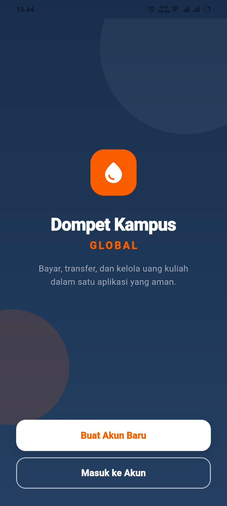
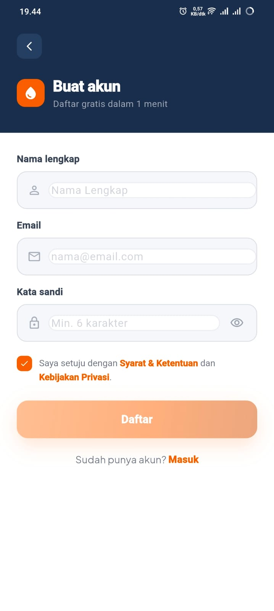
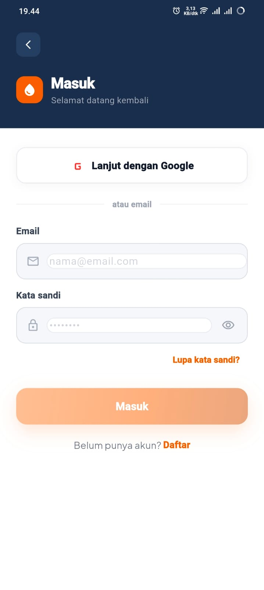
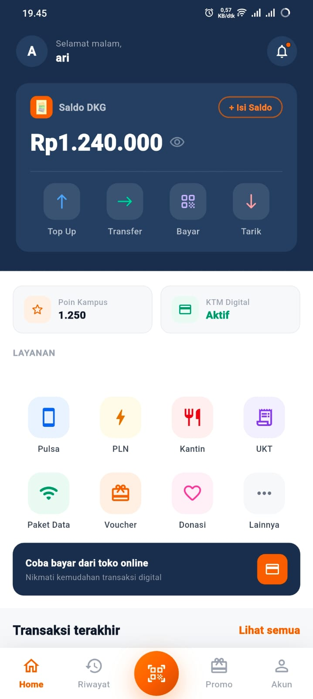
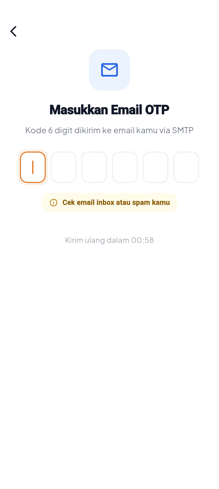
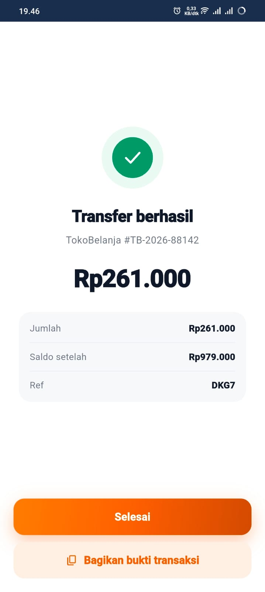
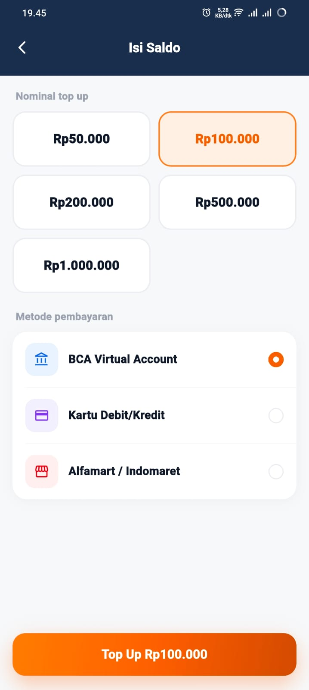
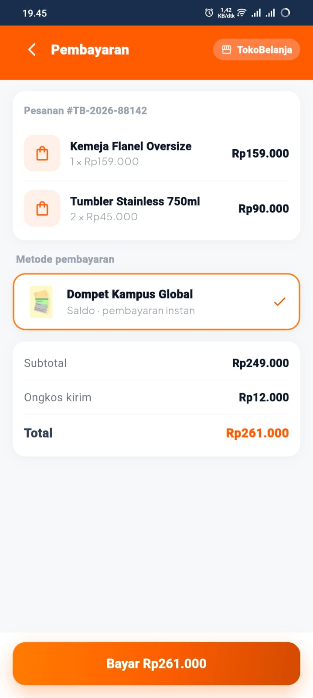
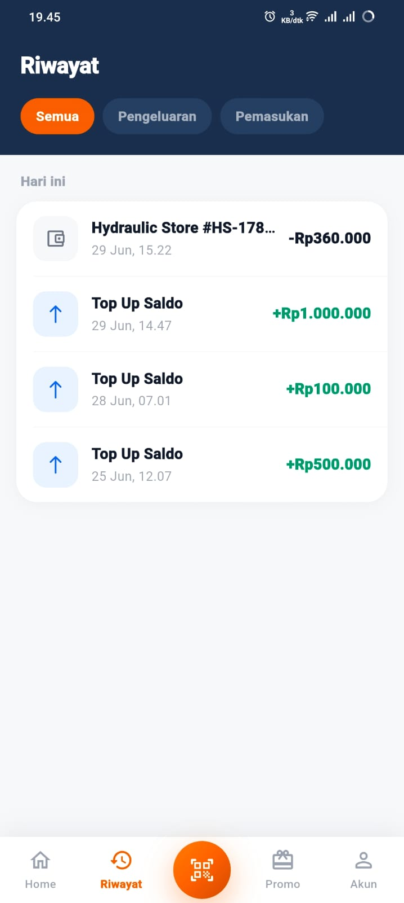

# Dompet Kampus Global — Aplikasi E-Money

Proyek dompet digital kampus untuk tugas akhir mata kuliah Aplikasi Mobile Lanjutan.
Aplikasi ini menggabungkan frontend Flutter dan backend Go dengan fitur autentikasi Firebase, 2FA, transaksi e-money, dan merchant checkout via deep link.

## Identitas Mahasiswa

- Nama: Ari Purwo Aji
- NIM: 1123150126
- Kelas: TI 23 SE M
- Email: 1123150126@global.ac.id

## Repository Terkait

| Nama Repository | URL |
| --- | --- |
| E-Commerce | https://github.com/AriPurwoAji/uts_mobile |
| E-Money | https://github.com/AriPurwoAji/dompet-kampus-global |

## Ringkasan Proyek

Dompet Kampus Global adalah aplikasi e-money yang dirancang untuk ekosistem kampus, yang memungkinkan mahasiswa:

- register, login, dan verifikasi email
- mengaktifkan 2FA melalui SMTP email, TOTP, atau notifikasi FCM
- top up saldo dompet digital
- melakukan transfer antar pengguna
- melakukan pembayaran merchant melalui deep link
- melihat riwayat transaksi dan status transaksi sukses
- mengamankan transaksi dengan kode OTP 6 digit sesuai metode 2FA

> Catatan: implementasi deep link pada proyek ini menggunakan scheme `dkg://checkout`.

## Arsitektur Aplikasi

Aplikasi ini menggunakan clean architecture dengan pemisahan lapisan:

- `presentation/` — halaman, BLoC, dan widget
- `domain/` — entities, use cases, repository abstraksi
- `data/` — implementasi repositori, datasource remote dan local
- `injection/` — dependency injection dengan `get_it`

Backend terpisah berbasis Go, Gin, MySQL, Redis, Firebase Admin SDK, dan JWT.

## Struktur Repository

```
emoney/
├── backend/                 # layanan backend Golang
│   ├── config/
│   ├── database/
│   ├── handlers/
│   ├── middleware/
│   ├── models/
│   ├── routes/
│   ├── services/
│   ├── .env
│   ├── firebase_service_account.json
│   ├── go.mod
│   └── main.go
├── mobile/                  # aplikasi Flutter
│   ├── lib/
│   ├── pubspec.yaml
│   ├── firebase.json
│   └── README.md
└── README.md                # dokumentasi root proyek
```

## Fitur Utama

- Autentikasi Firebase email/password dan Google Sign-In
- Verifikasi email dan 2FA (SMTP, TOTP, notifikasi)
- Top up saldo
- Transfer antar pengguna
- Pembayaran merchant via deep link
- Halaman sukses transaksi dengan detail
- Riwayat transaksi
- Keamanan PIN lokal 6 digit
- Notifikasi push real-time melalui FCM

## Dependensi Utama

### Flutter

- `flutter_bloc` — state management BLoC
- `go_router` — navigasi dan deep link
- `dio` — HTTP client
- `firebase_core`, `firebase_auth`, `firebase_messaging` — Firebase
- `google_sign_in` — login Google
- `flutter_secure_storage` — penyimpanan JWT dan data lokal aman
- `app_links` — handler deep link
- `mobile_scanner` — scanner QR
- `intl` — format angka/tanggal

### Backend Go

- `gin-gonic/gin` — HTTP router
- `gorm.io/gorm` + `gorm.io/driver/mysql` — MySQL ORM
- `github.com/redis/go-redis/v9` — Redis client
- `firebase.google.com/go/v4` — Firebase Admin SDK
- `github.com/golang-jwt/jwt/v5` — JWT auth
- `gopkg.in/gomail.v2` — SMTP email

## Cara Menjalankan Proyek

### 1. Jalankan Backend

```bash
cd backend
go run main.go
```

Backend akan berjalan di `http://localhost:8080` secara default.

### 2. Jalankan Frontend Flutter

```bash
cd mobile
flutter pub get
flutter run
```

### Konfigurasi API Flutter

Ubah alamat backend di `mobile/lib/core/constants/app_constants.dart` jika diperlukan.
Contoh:

```dart
static const String baseUrl = 'http://192.168.1.22:8080';
static const String apiVersion = '/v1';
```

Untuk Android emulator, gunakan `10.0.2.2:8080` jika backend berjalan di mesin host.

## Screenshot Aplikasi

| Splash Screen | Register Screen | Login Screen |
| --- | --- | --- |
|  |  |  |

| Home Dashboard | 2FA Email / TOTP | 2FA Notifikasi |
| --- | --- | --- |
|  |  |  |

| Top Up Screen | Pembayaran Merchant | Riwayat Transaksi |
| --- | --- | --- |
|  |  |  |

## Konfigurasi Backend

File `backend/.env` berisi variabel lingkungan penting seperti:

- `PORT`
- `DB_HOST`, `DB_PORT`, `DB_USER`, `DB_PASSWORD`, `DB_NAME`
- `REDIS_HOST`, `REDIS_PORT`, `REDIS_PASSWORD`
- `JWT_SECRET`
- `FIREBASE_CREDENTIALS_PATH`
- `FIREBASE_API_KEY`
- `SMTP_HOST`, `SMTP_PORT`, `SMTP_USER`, `SMTP_PASSWORD`, `SMTP_FROM`, `SMTP_FROM_NAME`
- `OTP_EXPIRY_MINUTES`

> Pastikan file `.env` dan `firebase_service_account.json` tidak dipublikasikan di repositori publik.

## API Backend Utama

- `POST /v1/auth/verify-token` — verifikasi token Firebase dan terbitkan JWT
- `POST /v1/auth/register` — registrasi user dan kirim OTP email
- `GET /v1/auth/me` — ambil data profil user
- `PUT /v1/auth/fcm-token` — simpan token FCM device
- `POST /v1/auth/verify-email-otp` — verifikasi kode OTP email
- `POST /v1/otp/send-firebase` — kirim OTP via FCM
- `POST /v1/otp/send-email` — kirim OTP via email
- `POST /v1/otp/confirm` — konfirmasi OTP
- `POST /v1/otp/totp/register` — register TOTP
- `POST /v1/otp/totp/verify` — verifikasi TOTP
- `GET /v1/account` — ambil saldo akun
- `GET /v1/account/transactions` — riwayat transaksi
- `POST /v1/payment/topup` — top up saldo
- `POST /v1/payment/transfer` — transfer saldo dengan OTP

## LINK VIDEO YOUTUBE

Comming soon